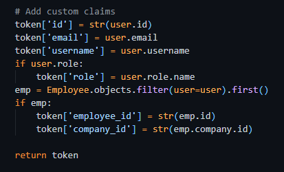
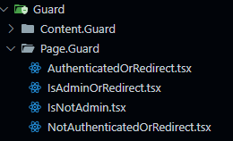
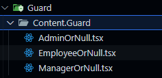
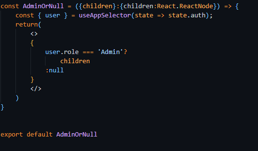
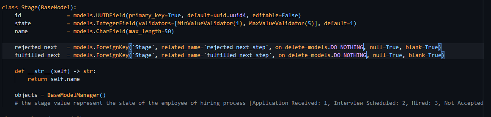
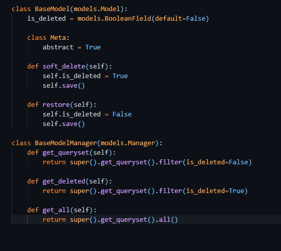

# Introduction
  - This web application build with <strong>Django</strong> as backend and 
  <strong>  React + TypeScript </strong> in frontend
  - I tried to do some bonus requirements, i will show the run of the web application in a video to make things more clear about some other points.
# Installition

 - ## Backend
    - install python 3.11.8 or later version on your machine
    - install the requirements.txt file you can find on <strong>Backend</strong> folder using the following command line
    ```
        pip install -r requirements.txt
    ```  
    - Note:
        + i used sqlite3 in this project to make it easy to run the code and the database file already included in the backend project files so you don't need to run migrations or migrate to launch database.

    - then run the next command to run backend server 
    ```
        python manage.py runserver
    ```
    
 - ## Frontend
    -  install Node.Js v18.18.0 or later version on your machine
    - go to frontend folder and run the next command to install the project packages
    ```
        npm install
    ```
    - then run the next command to run frontend 
    ```
        npm run dev
    ```
---
## Development Process
 - I decided to start with Database design to make next steps more clear in development

 
 ### Authentication & Permissions
  - i used <strong>JWT & Refresh Tokens</strong> with <strong>Djoser</strong> framework it depends on Simple JWT library to create refresh tokens, but i decided to make some modifications on that like 
    - Injecting  the refresh token in the cookie and automatic retreive it from the cookie without depending on frontend to store it
    - add custom attributes on 'access_token' as shown in the next image
    

    - i built a custom user model as you asked with the following attributes
        (id, username, email, role)
    
 - And on the frontend i built some custom filter to make sure no content appears to not authorized user based on his role Like 
    - make him not accessing the pages he don't have permission to access like

        
    - hide content in pages he can access but some content he shouldn't show like
    
    
---
 ### Modules & Apps
 - the backend has 2 main application except (accounts)

    - #### Companies
        Has all companies and its departments endpoints like 
        - Companies
            - list companies, details page, Create, Update, Delete Company
            - some sub endpoints like [ListCompaniesSelectList, CompanyForm] endpoints to get companies as select list (in case of creating Employee and Need only [id, name]) or edit company so we need its old data.
        - Departments
            - exactly the same as Company but have some extra endpoints
            like get company departments (all-data or select-list)
        
        - Employees
            - I made a mistake by assigning endpoints to the Employees app. I ran out of time to make the necessary changes. I was confused about the workflow, so some things were unclear to me. I'll provide more details soon.  


    - #### Employees
        This app has endpoints like list, details, create, update, delete, get form data (incase of update).

        - <strong>Get Hiring Stages endpoint</strong>  (bonus)
            - This endpoint should return the valid next step for the hiring process as described in the task. There are three cases to consider:
            in the task description but there are three cases 
                - employee just created so the return is [ 'Application Receieved' ] 
                - next step is ['Interview Scheduled' or 'Not Accepted']
                - in case of 'Interview Scheduled' the next step is ['Hired' or 'Not Accepted']
            The implementation mainly depends on the database schema I used to attribute to link the next two steps with the current one by adding ['next_fulfilled', 'next_rejected'] to easily determine what happens next in the two cases.
            

    ### Handle Cascading Deletions
    In my code, I implemented <strong>"soft delete"</strong> along with <strong>"Do Noting"</strong> to address this issue. To prevent this problem, I created a global filter to retrieve only non-deleted records by creating a <strong>"BaseModel"</strong> and making all other entities inherit from it. I also created custom functions to <strong>"soft_delete()"</strong>, <strong>"delete()"</strong>, and <strong>"retrieve_deleted_items()"</strong>.
    


## System Flow 
- List Companies
    (has some basics info about company like name and description)
    - Company Page
        (has some details like departments count, employee count, created at, departments name and description)
        - Dashboard (Admin or Manager)
            - Home: has form to edit company [name, description]
            - departments 
                - has list of departments
                - create a new departments 
                - edit department (in this company)
                - delete department (in this company)
            - Employees
                - has a Report Table to all company Employees
                - Add a New Employee (with already existing user account) (in this company)
                - edit employee data (in this company)
                - delete employee (in this company)
            - Delete the company Page
                - to delete the company you should enter your password to check the authentication
    - Employees
        - List of Employees Cards with option to see details of each
        - Can Create a new Employee
            - in this form we don't have the company_id like the previous case so the form here has a select input to select a company and then the Departments should updated based on the selected company

            


